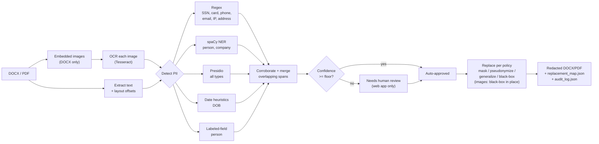
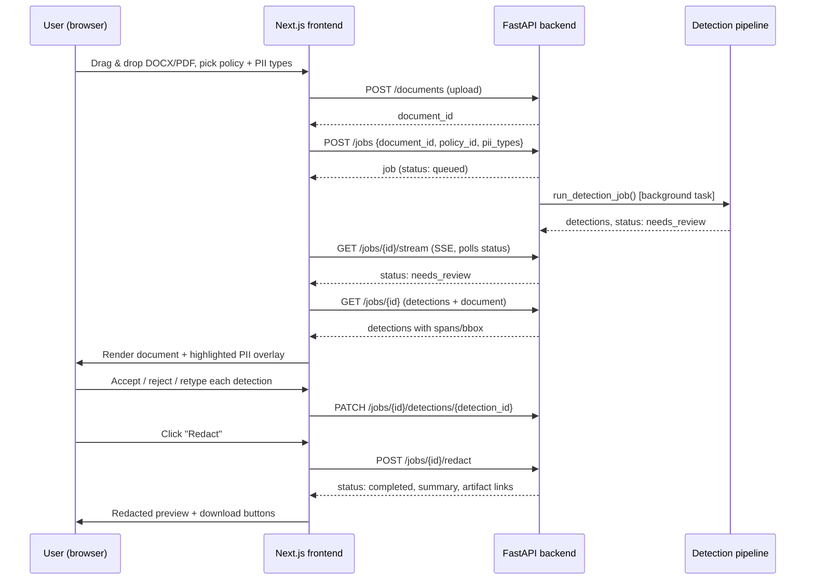

# PII Redaction Tool

Detects and redacts personally identifiable information in DOCX/PDF documents,
replacing each entity with a realistic fake alternative (or a mask, at your
choice), while leaving every other part of the document's formatting —
fonts, bold/italic, tables, headers, footers, images, hyperlinks — untouched.

Built for the "PII Redaction Tool" take-home assignment. Two ways to use it:

1. **A script** (`backend/scripts/redact.py`) — the literal ask: point it at a
   document, get a redacted DOCX/PDF back, plus a replacement map and audit
   log. No server, no database.
2. **A web app** (`frontend/` + `backend/`) — an extended version of the same
   pipeline with human-in-the-loop review, a policy engine, and an evaluation
   dashboard, built on top of the same detection/redaction core.

Both use the exact same detection and redaction code — the script is not a
separate, simpler implementation; it's the core engine with the server/UI
peeled off.

## Assignment coverage

| Requirement | Where |
|---|---|
| Full names | `detectors/spacy_detector.py`, `detectors/presidio_detector.py`, `detectors/labeled_field_detector.py` |
| Email addresses | `detectors/regex_detector.py` |
| Phone numbers | `detectors/regex_detector.py` |
| Company names | `detectors/spacy_detector.py`, `detectors/presidio_detector.py` |
| Physical/mailing addresses | `detectors/regex_detector.py`, `detectors/presidio_detector.py` |
| Social Security Numbers | `detectors/regex_detector.py` |
| Credit card numbers | `detectors/regex_detector.py` (Luhn-validated) |
| Dates of birth | `detectors/date_detector.py`, `detectors/presidio_detector.py` |
| IP addresses | `detectors/regex_detector.py` |
| Redacted output in DOCX | `replacement/docx_redactor.py` (also supports PDF) |
| Source code | `backend/` (detection + redaction + evaluation), `frontend/` (UI) |
| README (approach, tradeoffs, FP/FN) | this file — see [Detection approach](#detection-approach) and [Tradeoffs, false positives, false negatives](#tradeoffs-false-positives-and-false-negatives) |
| Evaluation approach + report (accuracy/precision/recall) | [Evaluation](#evaluation) — `backend/evaluation/entity_evaluator.py`, `backend/scripts/evaluate.py` |
| *Bonus, not required*: PII inside embedded images (e.g. a scanned ID card) | [Images embedded in a document](#images-embedded-in-a-document) — `backend/services/image_pii_service.py` |

## Quick start — the core script

```bash
cd backend
python -m venv .venv && source .venv/bin/activate
pip install -r requirements.txt
python -m spacy download en_core_web_lg

python scripts/redact.py --input /path/to/document.docx --output-dir out/
```

Produces, in `out/`:

- `<name>_redacted.docx` — the redacted document, formatting intact
- `replacement_map.json` — every original value and what it was replaced with
- `audit_log.json` — the same, plus span offsets, detector, and confidence per entity

Options:

```bash
# Simple masking instead of realistic fake values
python scripts/redact.py --input document.docx --output-dir out/ --strategy mask

# Only certain PII types, and a stricter confidence floor
python scripts/redact.py --input document.docx --output-dir out/ \
  --pii-types person,email,phone --confidence-floor 0.85
```

Run `python scripts/evaluate.py --explain` to see the precision/recall/F1
formulas, or see [Evaluation](#evaluation) below to score a run against
ground truth.

## How it works



**Extraction** (`services/extraction/`) walks the DOCX XML run-by-run (so
redaction can mutate the exact same runs later without breaking formatting)
or the PDF word-by-word via PyMuPDF (so every detection carries a page + a
pixel bounding box, not just a character offset).

**Detection** (`services/detection_service.py`) fans out to five independent
detectors, then:
1. **Corroborates** — two detectors independently agreeing on the same span
   and type nudges confidence up (a regex SSN match and Presidio's SSN
   recognizer both firing is a stronger signal than either alone).
2. **Extends company spans** over trailing legal suffixes ("Ltd.", "Inc.")
   that NER is inconsistent about including.
3. **Merges overlaps** — highest confidence wins a span conflict, with one
   structural exception: a deterministic regex match that fully *contains* a
   lower-priority NER fragment of a different type wins regardless of the
   raw confidence gap (stops "Evergreen Terrace" being redacted as a company
   name instead of as part of the address it's actually inside).
4. **Normalizes** — trims incidental trailing punctuation a greedy match
   picked up, keeping `text == source[start:end]` true for every entity.

**Redaction** (`replacement/`) never touches anything outside detected spans.
DOCX redaction rewrites `run.text` in place — the run's font, bold, italic,
underline, and every sibling element (images, hyperlinks) is untouched. PDF
redaction uses PyMuPDF's real redaction annotations, which strip the glyphs
from the content stream — not a black box painted over still-selectable text.

## Detection approach

Five detectors, each doing the part it's actually good at:

| Detector | Types | Why |
|---|---|---|
| **Regex** (`regex_detector.py`) | SSN, credit card, phone, email, IP, address | Fixed-shape data — a model adds latency and false negatives here. Credit cards are Luhn-validated; IPs are range-validated. |
| **Date heuristics** (`date_detector.py`) | DOB | Parses date-shaped strings, then a fuzzy keyword check ("date of birth", "DOB", "born"...) in the surrounding text — a bare date is not a DOB just because it's a date. |
| **spaCy NER** (`spacy_detector.py`) | Person, company | Statistical entity recognition, independent model instance from Presidio's — used to corroborate it. |
| **Microsoft Presidio** (`presidio_detector.py`) | All 9 types | Wraps its own recognizers plus spaCy-NER-derived entities; the primary statistical source. |
| **Labeled-field heuristic** (`labeled_field_detector.py`) | Person | See below — a targeted fix for a real gap the other four have. |

### Why the labeled-field detector exists

Testing against realistically-formatted data (Indian names, "Label: Value"
form fields — the exact shape of the assignment's own example) surfaced a
real, reproducible spaCy/Presidio failure mode:

```
"Applicant: Rashi Patil"              -> 0 entities (should be 1)
"Applicant Name: Rashi Patil"         -> 0 entities
"Dear Rashi Patil, thank you..."      -> 1 entity, but only "Patil" (dropped "Rashi")
"Rashi Patil applied for the role."   -> 1 entity, correct: "Rashi Patil"
"Name: Rohan Dey"                     -> 1 entity, correct: "Rohan Dey"
```

Both spaCy and Presidio (which shares spaCy's NER under the hood) are
consistently unreliable on short, sentence-less "Label: Value" structures —
exactly the shape of most form fields, ticket headers, and prospectus cover
pages — even for names they handle correctly in full-sentence prose, and
even when a near-identical field one line down works fine. This is a known,
inherent limitation of general-purpose NER, not a bug in this codebase.

Rather than accept the recall loss, `labeled_field_detector.py` adds a
deterministic fallback: a small set of trigger labels (`Applicant`, `Contact
Person`, `Authorized Signatory`, `Dear`, ...) followed by two to four
capitalized words. It corroborates spaCy/Presidio when they agree, and
stands alone as a recall safety net when they don't — while excluding bare
`"Name:"` (too ambiguous — company/product/file name are all common) and
filtering out non-person words that fit the same shape ("Dear Customer
Service" is not a person). Single generic legal-role nouns (`Director`,
`Promoter`, `Signatory`, `Witness`, `Guarantor`) require a literal colon
before they trigger — found against a real IPO prospectus that bare
`Promoter`/`Director` are constantly the first word of an unrelated defined
legal term ("Promoter Selling Shareholder", "Director Identification
Number"), not a "Label: Name" field.

### Extending to a new PII type

1. Add the type to `schemas/common.py`'s `PIIType` enum.
2. Write one class implementing `detectors/base.py`'s `BaseDetector`
   (`name`, `supports`, `detect`) — reuse an existing detector if the new
   type is format-anchored (regex) or reuses NER (spaCy/Presidio), or write a
   new one if it needs its own logic.
3. Register the instance in `core/container.py`'s `get_detector_registry()`.
4. Add a fake-value generator for it in `replacement/faker_engine.py`.
5. Add it to the frontend's `ALL_PII_TYPES` / `PII_TYPE_COLORS` if you want
   it selectable and color-coded in the UI.

Nothing else changes — the pipeline, merge/corroboration logic, replacement
engine, and API are all written against the enum and the detector interface,
not against a hardcoded type list.

### Images embedded in a document

A scanned ID card, screenshot, or photo pasted into a DOCX isn't just inert
pixels here. `services/image_pii_service.py` OCRs every embedded image
(Tesseract, via `pytesseract`), runs the exact same detection pipeline
against the extracted text, and black-boxes the matching word regions
directly in the image — captured in the audit log under each image's
`image_filename` (the part's actual package path, e.g.
`/word/media/image4.png` — not the generic `image.png`/`image.jpeg` name
python-docx substitutes when the original filename wasn't preserved, which
collides across multiple images in the same document).

**Scope, stated plainly**: this redacts OCR-detected *English* text only.
No face detection (a photo on an ID card is untouched — flagged as a
known gap, not attempted here), and no recognition of non-US/non-generic
national ID numbers (a PAN or Aadhaar number isn't SSN- or credit-card-
shaped, so it isn't caught by those detectors).

This was tested against two scanned ID cards genuinely embedded in the
assignment's own source document (a PAN card and an Aadhaar card, both
bilingual English/Devanagari) — real results, not a synthetic demo:

- Correctly OCR'd and redacted: the date of birth, several address
  fragments, and some English name text.
- **Not redacted: the Devanagari (Hindi) name, father's name, address,
  and DOB fields on both cards** — pytesseract is only configured for
  English OCR here, and spaCy's `en_core_web_lg` has no ability to
  recognize Hindi text as a person/location regardless. Every Indian ID
  card in this document is bilingual, so this is a real, significant,
  disclosed gap, not an edge case — extending to Hindi would need a
  Devanagari Tesseract language pack (`lang="hin"`) and very likely a
  different NER model, since spaCy's English model won't recognize
  entities in a script it wasn't trained on.
- Partial redaction on some fields (e.g., only the surname of a two-word
  name got boxed) — an OCR word-segmentation edge case, not a systemic
  failure; the audit log records exactly which words were and weren't
  covered.
- The PAN and Aadhaar numbers themselves were correctly left alone (out
  of the assignment's 9 required types) — the QR code and photo on both
  cards were, as scoped, untouched.

See [`deliverables/README.md`](deliverables/README.md) for the actual
before/after images.

## Tradeoffs, false positives, and false negatives

**Design choice: everything in scope is treated as sensitive by default,
including phone numbers and IP addresses**, since the assignment's own
minimum list includes them explicitly. `[REDACTED-ADDRESS]`-style masking
is available via `--strategy mask` for anything you'd rather generalize
instead of fully fake.

**Deliberately not treated as PII**: order/ticket/invoice numbers, dates that
aren't a birth date (an invoice date next to "Invoice #4471, dated
03/14/2024" is not redacted — the date detector requires nearby birth-context
language), and generic organizational role titles. This is an explicit
precision choice, matching the assignment's own framing of it as a judgment
call.

**Known false negatives** (measured against the real evaluation in
[`deliverables/`](deliverables/), not hypothesized):
- Two people listed with a slash separator ("Lokesh Shah/ Soumavo Sarkar")
  get merged by NER into one span, and that merged span is then sometimes
  mistyped as a company rather than a person — both names effectively lost.
- Short or table-context names NER simply misses entirely with no adjacent
  label to trigger the fallback detector ("Indu Jacob" as a lone table row).
- Multi-line Indian addresses (street on one line, city+PIN the next, state
  the one after) aren't reconstructed into one span — the regex only matches
  single-line, structurally-anchored address patterns. Fragments (city
  names, street lines) are often still caught individually, so information
  still gets redacted, just not as one clean address entity.
- Comma-separated lists of names after one label ("Directors: A, B, C") — the
  labeled-field detector only captures the first name.

**Known false positives** (same source):
- spaCy tags Indian place names as PERSON ("Taluka-Khed", "Shivaji Nagar",
  "Erandawane") — a location-gazetteer check would fix this; out of scope
  here.
- Legal/financial defined terms after "the"/"our"/"this" with no company
  suffix ("the Registrar of Companies", "our Board of Directors", "the
  Anchor Investor Application Form") still get through sometimes — general
  legal prose is dense with exactly this capitalization convention, and two
  targeted mitigations (`utils/fuzzy.py::adjust_company_confidence`'s
  generic-term and defined-term-article checks) reduced but didn't
  eliminate it. On the real evaluation sample this is the dominant source of
  false positives — company recall was 100% but precision was 6.6%, i.e.
  every real company name was found, buried in noise from defined terms.
- Street/housing-society names read as plausible company names to NER
  ("Deccan Gymkhana Society", "Senapati Bapat Road") — the same underlying
  cause as the point above.
- "Dear <capitalized two-plus words>" where those words are a department or
  role, not a person, if not in the small denylist (`sir`, `madam`, `team`,
  `service`, `customer`, ...).

The full breakdown — precision/recall per type, why each number is what it
is, and the six real bugs (including one severe extraction bug) found and
fixed by running an actual 300-page document through this pipeline — is in
[`deliverables/README.md`](deliverables/README.md).

## Evaluation

Two independent evaluation paths exist:

1. **Bundled synthetic gold-standard set** (`evaluation/pipeline.py`,
   `evaluation/sample_dataset.py`) — a small, hand-labeled dataset covering
   all 9 types, used as a fast regression gate. Run it via the web app's
   `/evaluation` dashboard, or `POST /api/v1/evaluation/runs` directly.

2. **Ground-truth-vs-prediction comparison** (`evaluation/entity_evaluator.py`,
   `scripts/evaluate.py`) — compares any ground-truth entity list against any
   prediction list (span overlap + type match = true positive) and reports:
   - **Precision** = TP / (TP + FP)
   - **Recall** = TP / (TP + FN)
   - **F1** = 2·Precision·Recall / (Precision + Recall)
   - **Entity accuracy** = TP / (TP + FP + FN)
   - a confusion matrix and a per-type classification report
   - exported as JSON, CSV, Markdown, and PDF

To evaluate a real document: run `redact.py`, hand-correct the audit log (or
run `scripts/evaluate.py` with no ground-truth file yet — it generates an
annotation template from the predictions for you to review), then:

```bash
python scripts/evaluate.py --ground-truth ground_truth.json \
  --predictions predictions.json --output-dir eval_reports/
```

> **The run against this assignment's actual source document** — KSH
> International Limited's Red Herring Prospectus, a real ~300-page, 76-table
> IPO filing — is checked in at [`deliverables/`](deliverables/): the
> redacted DOCX, replacement map, audit log, and an evaluation report with
> real precision/recall/F1 numbers against a hand-verified sample, plus a
> full write-up of what the numbers mean per PII type and **six real bugs**
> (one severe: an entire table's data was silently dropped from extraction)
> found and fixed by running this document through the pipeline. Start with
> [`deliverables/README.md`](deliverables/README.md).

## The web application

An extended version of the same pipeline: upload → human review → redact →
audit trail, plus a dashboard for the evaluation numbers above.



- **Landing page** (`/`) — what the tool does, no auth required.
- **Workspace** (`/workspace`) — upload, policy + PII-type selection, recent
  jobs.
- **Job detail** (`/workspace/jobs/[id]`) — live status, side-by-side
  original/redacted preview (PDF via bounding-box overlay, DOCX via
  rendered-HTML text highlighting), accept/reject/retype review, redact
  action, downloads.
- **Evaluation dashboard** (`/evaluation`) — run the bundled evaluation,
  view precision/recall/F1 charts and a TP/FP/FN breakdown per type, and
  browse the audit log of any completed job (with a mask/reveal toggle on
  the original values).

Full frontend documentation, including the preview implementation notes, is
in [`frontend/README.md`](frontend/README.md).

## Repository layout

```
backend/
  detectors/       five PII detectors + the plugin registry
  services/        detection pipeline (merge/corroborate/normalize), document/job/policy CRUD, storage
  replacement/      redaction: strategies, Faker-backed pseudonymization, DOCX/PDF redactors
  evaluation/       gold-standard regression pipeline + ground-truth comparison/reporting
  api/v1/           FastAPI routes
  scripts/          redact.py (core deliverable), evaluate.py (CLI eval runner)
  tests/unit/       180+ tests — detectors, pipeline merge logic, redaction, evaluation, security
frontend/
  src/app/          landing, workspace, job detail, evaluation dashboard (Next.js App Router)
  src/components/   preview (PDF/DOCX + highlights), review UI, charts
  src/lib/          typed API client, shared types, color tokens
```

## Testing

```bash
cd backend
source .venv/bin/activate
pytest tests/unit -q
```

180+ tests: every detector in isolation, the merge/corroboration/
normalization algorithms (constructed entities, no model needed — fast),
DOCX redaction with real `python-docx` documents (formatting preserved,
partial-word rejection), the evaluation module's metrics and report
generation, and security-sensitive paths (the signed-download-token HMAC
scheme, the storage path-traversal guard, the API-key comparison).

```bash
cd frontend
npm run lint && npx tsc --noEmit && npm run build
```

## Deployment

### Backend (Docker)

```bash
cd backend
docker build -t pii-redactor-api .
docker run -p 8000:8000 \
  -e API_KEY=your-production-key \
  -e SECRET_KEY=$(openssl rand -hex 32) \
  -e CORS_ORIGINS='["https://your-frontend-domain.com"]' \
  pii-redactor-api
```

Defaults to local disk storage + SQLite — fine for a single instance. For
multi-instance deployment, set `DATABASE_URL` to Postgres and
`STORAGE_BACKEND=s3` with the `S3_*` variables (an S3-compatible adapter is
already implemented in `services/storage_service.py`).

Any container platform works (Railway, Fly.io, Render, ECS, ...) — the
Dockerfile is standard, no platform-specific config needed. Health check:
`GET /health`.

### Frontend (Vercel)

Zero-config — Vercel auto-detects the Next.js app.

1. Import `frontend/` as the project root in Vercel.
2. Set `NEXT_PUBLIC_API_URL` (and `NEXT_PUBLIC_API_KEY` if the backend has
   `API_KEY` set) to your deployed backend's public URL.
3. Add the Vercel domain to the backend's `CORS_ORIGINS`.

Full details in [`frontend/README.md`](frontend/README.md).
